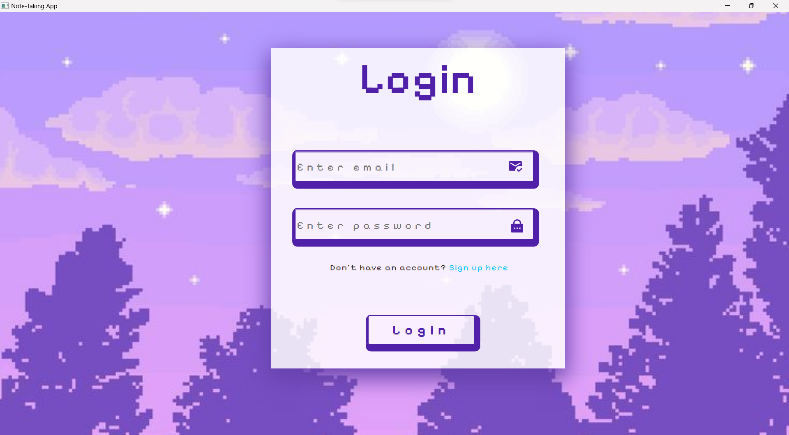
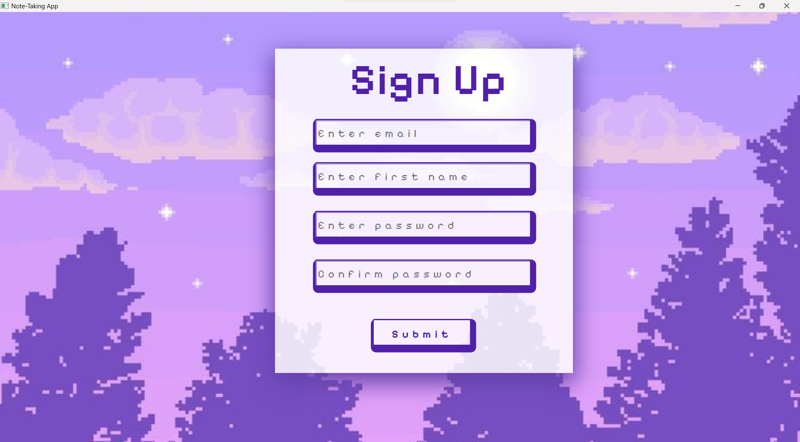
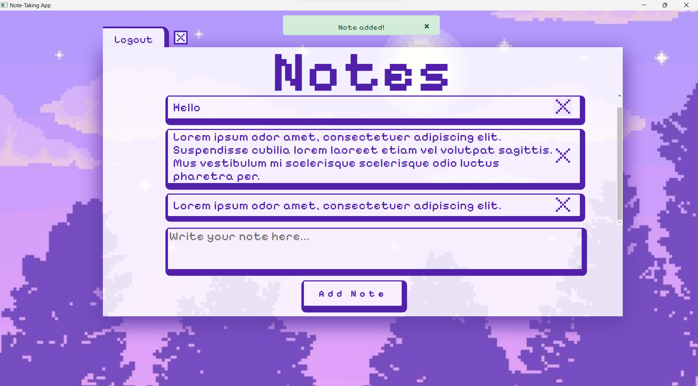

# Note-Taking Desktop App

## Overview
This is a **desktop application** for taking and managing notes, built using:
- **Flask** for the backend and web interface.
- **SQLite** for database storage.
- **PyQt** for the desktop wrapper.

The app allows users to:
- Create, read, update, and delete notes.
- Log in and sign up for personalized note management.
- Access the app offline in a desktop environment.


## Features
- **User Authentication**:
  - Log in and sign up with email and password.
  - Secure password hashing using Flask-Login.
- **Note Management**:
  - Add, edit, and delete notes.
  - View all notes in a user-friendly interface.
- **Database**:
  - Uses **SQLite** to store user data and notes.
- **Desktop Integration**:
  - Runs as a standalone desktop application.
  - System tray icon for quick access (optional).


## Technologies Used
- **Backend**: Flask, Flask-Login, Flask-SQLAlchemy.
- **Frontend**: HTML, CSS, JavaScript.
- **Database**: SQLite.
- **Desktop Wrapper**: PyQt5.


## Screenshots
Include screenshots of your app to give users a visual preview. For example:
1. **Login Page**:
   
2. **SignUp Page**:
      
3. **Home Page**:
   


### Prerequisites
- Python 3.8 or higher.
- pip (Python package manager).

### Installation
1. **Clone the Repository**:
   ```bash
   git clone https://github.com/your-username/note-taking-app.git
   cd note-taking-app
   ```

2. **Install Dependencies**:
   ```bash
   pip install -r requirements.txt
   ```

3. **Create the Database**:
   - Run the following command to initialize the SQLite database:
     ```bash
     python
     >>> from website import create_app, db
     >>> app = create_app()
     >>> with app.app_context():
     ...     db.create_all()
     ```
   - This will create a `database.db` file in the `website` folder.

4. **Run the Application**:
   - **Development Mode**:
     ```bash
     python desktop_wrapper.py
     ```
   - **Packaged Mode** (if you’ve built the executable):
     - Navigate to the `dist` folder and run the executable:
       ```bash
       ./desktop_wrapper  # On macOS/Linux
       desktop_wrapper.exe  # On Windows
       ```


## Packaging the App
To package the app into a standalone executable:
1. Install PyInstaller:
   ```bash
   pip install pyinstaller
   ```
2. Run the build script:
   ```bash
   pyinstaller --onefile --windowed desktop_wrapper.py
   ```
3. The executable will be created in the `dist` folder.


## License
This project is licensed under the **MIT License**. See the [LICENSE](LICENSE) file for details.